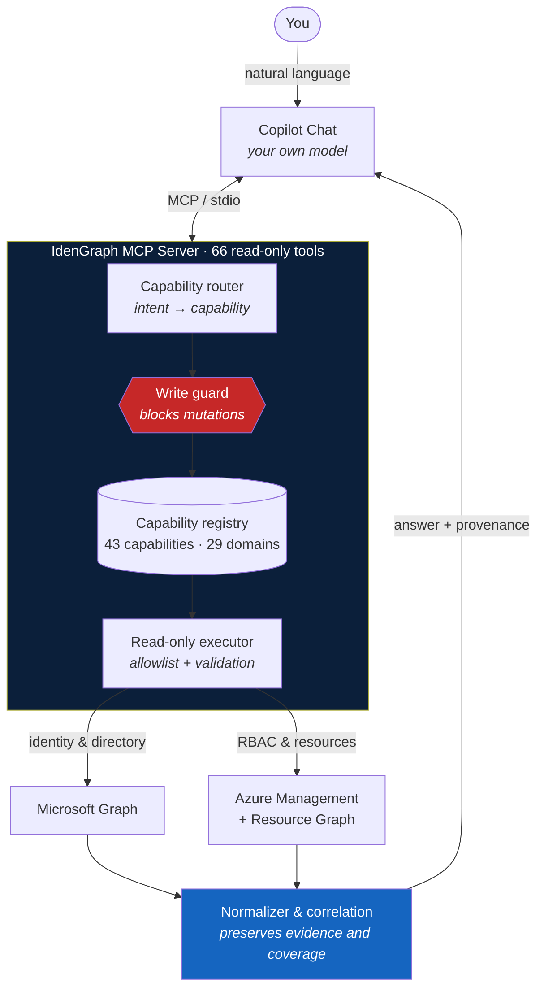

# IdenGraph

**Identity & Access intelligence powered by Microsoft Graph and MCP.**

A read-only MCP server that turns natural-language questions into audited answers about **Microsoft Entra ID** and **Azure RBAC** — answered by your own Copilot, inside VS Code.

[](https://marketplace.visualstudio.com/items?itemName=josimarh.idengraph)
[](https://pypi.org/project/azure-mcp-pilot/)
[](LICENSE)

> **It never writes.** Every create, update, delete, grant, or privilege-activation operation is blocked before routing.

## What you can ask

- Who has **Owner** on Azure? And who holds **Global Administrator** in Entra?
- Which applications were **created in my tenant**, and which are Microsoft first-party?
- Which users have **no MFA**, or rely on weak methods?
- Which **application secrets** expire in the next 30 days?
- Which objects have **no owner** assigned?
- What is the **blast radius** of a given identity?
- Are we **paying for security features we don't use**?

**66 tools** across users, groups, applications, service principals, managed identities, PIM, RBAC, authentication, conditional access, ownership, privilege timeline, licensing posture, and toxic combinations (SoD).

## Design principles

These three rules define the behavior, and they matter more than the feature list.

### Source separation

Microsoft Graph answers for identity and directory. Azure APIs answer for RBAC and resources. **Graph is never treated as a source of truth for Azure RBAC.**

### No false zero

If a permission is missing, the answer is `PERMISSION_DENIED` with `NOT_EVALUATED` coverage — **never `0`**.

"I could not evaluate this" and "this does not exist" are different answers. Conflating them in an audit is worse than not answering at all, because a false zero looks like a clean result.

This applies to licensing too: zero conditional access policies means something entirely different when the feature isn't licensed versus when it's licensed and unused.

### Read-only by construction

Only `GET`, `LIST`, `QUERY`, `ASSESS`, and `CORRELATE`. There is no LLM-generated KQL and no free-form endpoint: every query goes through a capability registry with an allowlist and validation of filters and scopes.

## Architecture



Two details worth highlighting:

**The write guard sits before routing**, not after. A mutation request is rejected before it can be interpreted as a query.

**The normalizer preserves coverage**, not just data. Every answer carries where it came from and whether the source could actually be evaluated — which is what makes the no-false-zero rule enforceable rather than aspirational.

### How the pieces are distributed

| Layer | Artifact | Role |
|---|---|---|
| Discovery | [VS Code extension](https://marketplace.visualstudio.com/items?itemName=josimarh.idengraph) | One-click install, prerequisite checks, settings UI |
| Engine | [`azure-mcp-pilot` on PyPI](https://pypi.org/project/azure-mcp-pilot/) | The MCP server itself |
| Model | Your Copilot subscription | No LLM cost to this project or to you |

The extension does not replace the Python package — it registers it. The engine runs the same way whether launched by the extension or configured by hand.

## Install

### Recommended: VS Code extension

Install **[IdenGraph](https://marketplace.visualstudio.com/items?itemName=josimarh.idengraph)** from the Marketplace, then sign in to Azure:

```bash
az login
```

Open Copilot Chat in **agent mode** and ask. The extension verifies prerequisites and guides you if anything is missing.

### Alternative: manual MCP configuration

Create `.vscode/mcp.json`:

```json
{
  "servers": {
    "idengraph": {
      "type": "stdio",
      "command": "uvx",
      "args": ["azure-mcp-pilot"],
      "env": { "MOCK_MODE": "false" }
    }
  }
}
```

## Prerequisites

- **Python 3.10+**
- **[uv](https://docs.astral.sh/uv/getting-started/installation/)**
- **[Azure CLI](https://learn.microsoft.com/cli/azure/install-azure-cli)** with an active session (`az login`)

Authentication uses `DefaultAzureCredential`, which reuses your Azure CLI session. There is no API key to manage, and no credential is stored by this project.

## Configuration

| Setting | Env var | Default | Purpose |
|---|---|---|---|
| `idengraph.useMockData` | `MOCK_MODE` | `false` (extension) | Query fictional data instead of your tenant |
| `idengraph.sanitizeOutput` | `SANITIZE_FOR_LLM` | `true` | Mask resource names, subscription IDs, and IPs before they reach the model |
| `idengraph.subscriptions` | `AZURE_SUBSCRIPTIONS` | all accessible | Restrict queries to specific subscriptions |

The Python package defaults to `MOCK_MODE=true` so that nothing touches a real tenant without explicit intent. The extension sets it to `false`, since installing it is already that intent.

## Permissions

On Azure: **`Reader`** on the subscriptions you want to audit.

On Microsoft Graph, delegated permissions vary by question:

| Area | Permission |
|---|---|
| Users, groups, applications, service principals | `Directory.Read.All` |
| Directory roles and directory PIM | `RoleManagement.Read.All` |
| Authentication methods and MFA | `UserAuthenticationMethod.Read.All` |
| Conditional access | `Policy.Read.All` |
| License posture | `Organization.Read.All` |

Missing a permission only marks the matching area as not evaluated. Everything else keeps working — and the affected area reports *why* it could not be evaluated.

## Privacy

Queried data belongs to **your** tenant and travels between your machine, Microsoft APIs, and the Copilot model **you already use**. This project sends nothing to third-party servers and collects no telemetry.

By default, `SANITIZE_FOR_LLM=true` masks resource names, resource groups, subscription IDs, and IP addresses before content reaches the model.

## Development

```bash
python -m venv .venv
.venv\Scripts\activate        # Windows
# source .venv/bin/activate   # Linux/macOS
pip install -r requirements.txt
cp .env.example .env
python test_smoke.py
```

The smoke test runs in mock mode and never touches a tenant.

### Repository layout

```text
mcp_server.py                       MCP server and tool registration
services/azure_auth.py              credentials, tokens, caching
services/graph_capabilities.py      capability registry
services/capability_router.py       natural language → capability
services/capability_executor.py     validated read-only execution
services/azure_role_definitions.py  authoritative Azure role name resolution
services/azure_pim.py               resource PIM with confirmed coverage
services/entra_licenses.py          tenant licensing and feature availability
services/data/                      mock data used when MOCK_MODE=true
extension/                          VS Code extension (TypeScript)
```

The repository also contains a Streamlit portal (`app.py` + `agent.py`) used for development and demos. It is not part of the published package, whose surface is the MCP server only:

```bash
streamlit run app.py
```

## Known limitations

- Agent Identity detection is **heuristic** where the directory exposes no dedicated type. Results are labeled as such, never presented as fact.
- `Public IP` indicates a public address, which **does not prove** workload exposure.
- Without `RoleManagement.Read.All`, directory PIM reports as not evaluated rather than empty.
- License posture currently cross-references PIM and Conditional Access. Capabilities still marked `not_integrated` in the registry are not probed, and deliberately return no verdict.

## License

MIT — see [LICENSE](LICENSE).
